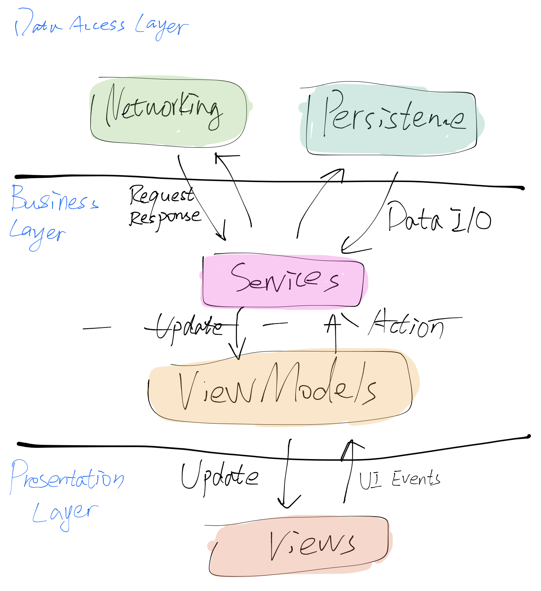
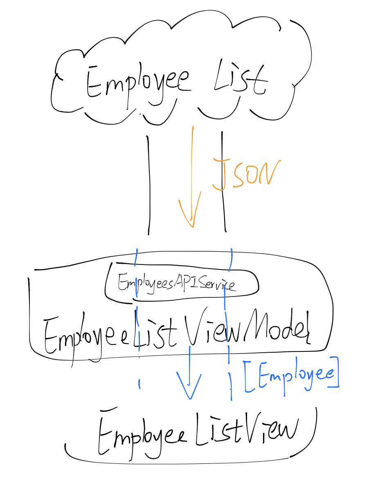
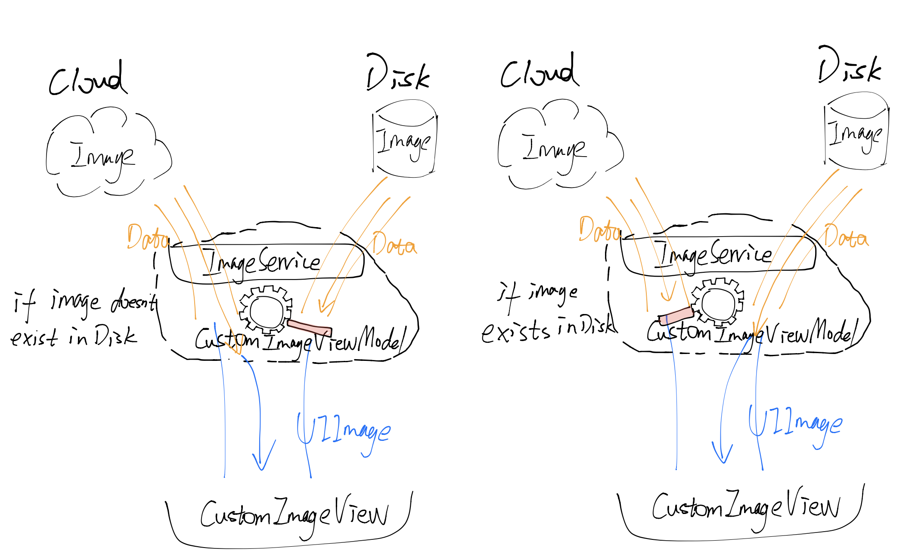

<#Employee List#>

# Build Tools & Version Used & Phone Focus
Xcode 11.5 

iOS 13.0+ (for Combine framework)

No external dependencies

Focused on phone

# Focus Area
I mostly focused on the architecture and data flow design.
## Architecture
I used MVVM + Combine architecture.



### Data Access Layer

Data Access Layer consists of `Utils` and `Persistence`.

`Utils` provides asynchronous APIs for networking. `Persistence` provides interfaces to store and retrieve images. Both pass data as a `Publisher` from `Combine` framework. They are accessible and used only by the `Services` in the business layer.

***Protocol-oriented networking***

I defined `APIRequestType` protocol and `APIServiceType` protocol.

This approach avoids constantly changes to make room for new network requests and data types. It allows us to create as many types of requests as we need. All we need to do is add new classes that comform to these two protocols. There is no need to change existing code, respecting the Open-closed principle.

Also, this approach allows dependency injection that makes the code more testable.

### Business Logic Layer

Business Logic Layer includes `Services` and `ViewModels`. 

For the current required features, `Services` consists of `EmployeesAPIService` that receives requests to download the employee list from the given remote endpoint, and `ImageService` that either receives requests to download images remotely or retrieves images from the disk locally. Note that `ImageService` comforms to `ImageServiceType` such that we can use dependency injection to inject `MockImageService` in `ViewModel` in unit tests.

`ViewModels` work between `Views` and `Services`, encapsulating business logic to the `Views`. `ViewModels` are downstream subscribers that receive and process whatever is passed from upstream publishers. They are marked as `@ObservedObject` such that SwiftUI is able to monitor `ViewModels` for updates and redraw the UI.

### Presentation Layer

Presentation Layer is represented by `Views`.

Views are independent from business logic. Side effects are triggered by the view lifecycle event `onAppear` and are forwarded to the corresponding the `ViewModel`

## Data flow

***Yet another informal data flow chart***





# Copied-in code or copied-in dependencies
I copied the following code snippets for making mock APIService in unit tests.
[Source](https://github.com/kitasuke/SwiftUI-MVVM/blob/master/SwiftUI-MVVMTests/MockAPISearvice.swift)
```swift
var stubs: [Any] = []

func stub<Request>(for type: Request.Type, response: @escaping ((Request) -> AnyPublisher<Request.ModelType, Error>)) where Request: APIRequestType {
        stubs.append(response)
    }
    
func call<Request>(from request: Request) -> AnyPublisher<Request.ModelType, Error> where Request: APIRequestType {
    
    let response = stubs.compactMap { stub -> AnyPublisher<Request.ModelType, Error>? in
        let stub = stub as? ((Request) -> AnyPublisher<Request.ModelType, Error>)
        return stub?(request)
    }.last
    
    return response ?? Empty<Request.ModelType, Error>()
        .eraseToAnyPublisher()
}
```
# Spent time
Roughly 6.5 hours

# Unit testing

With limited time, I implemented two unit test suites

### Implemented unit tests:

EmployeeListViewModel

    - should fetch data from the EmployeesService
    - should display an error message if the request failed

CustomImageViewModel

    - should fetch image from the ImageService
    - should display the default photo placeholder if photo loading failed
    - should dispaly an error message if any error incurred during persistence

### Other reasonable unit tests (not yet implemented)

OnDiskCache

    - should store an image with a correct key
    - should pass a Fail Publisher to downstreams if storing failed
    - should pass a Publisher with image data with a correct key
    - should pass a Fail Publisher to downstreams if fetching failed

EmployeesService

    - should send a request to the given endpoint and pass a Publisher with a decoded list of Employee type
    - should pass a Fail Publisher to downstreams if any error

ImageService

    - should send a request to the given endpoint and pass a Publisher with the Data (or error) to downstreams
    - should load the image Data from disk and pass a Publisher with the fetched image Data (or error) to downstreams
    - should save an image to disk and pass a Publisher with the  storing result to downstreams


  
